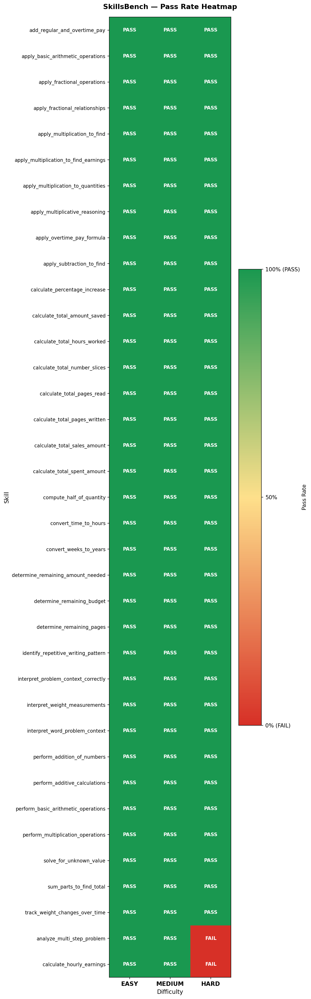
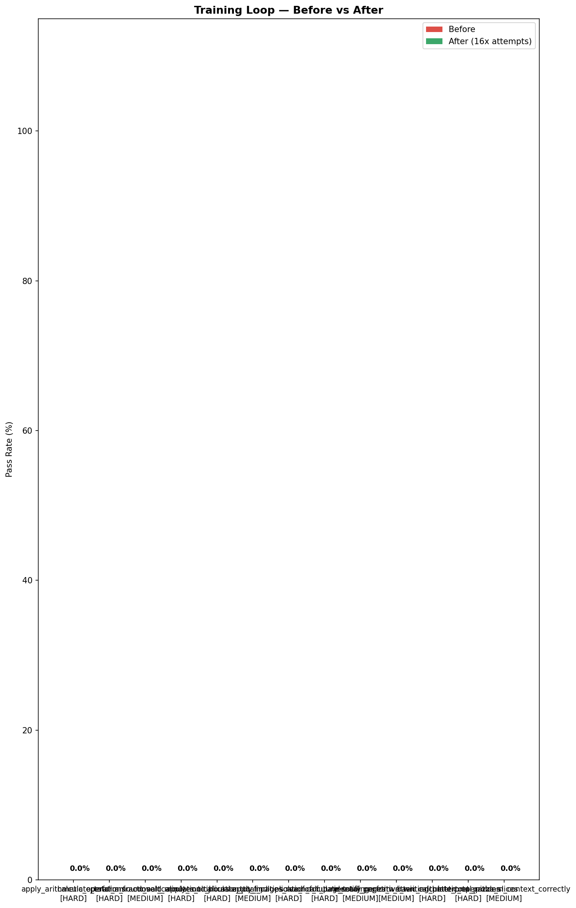
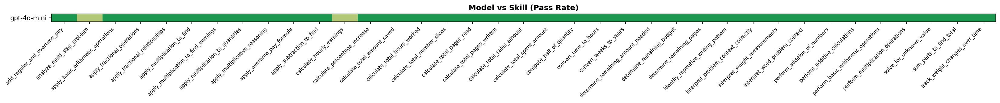
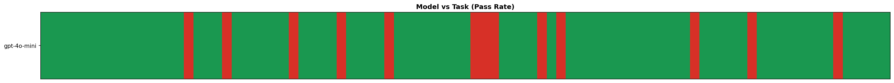
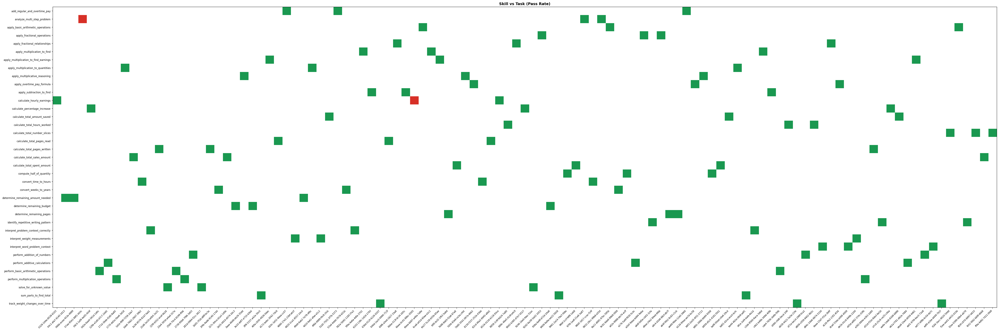
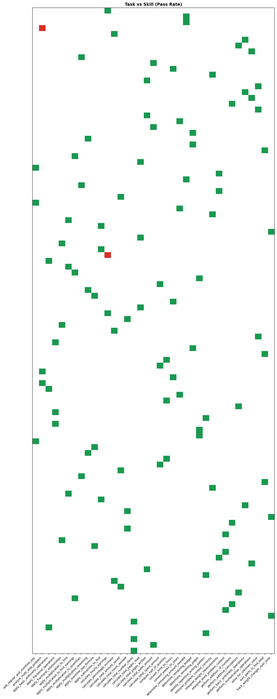

# LLM Skills and Metacognition Pipeline

Baseline pipeline for pulling out skills from math problems, then producing synthetic tasks, checking how well the model performs,  and finally ranking the difficulty.  This whole project came from newer findings about LLM skills and a kind of metacognition, but it’s mostly about a one model prototype to really test the workflow from start to finish end to end.

## Project Structure

- data/: generated artifacts (skills, tasks, evaluations, training data)
- outputs/: plots and visualizations
- prompts/: LLM prompt templates
- src/: pipeline modules
- analyze_evalution.ipynb: analysis and reporting notebook
- main.py: pipeline entry point

## Outputs and Figures

Generated figures are saved in the outputs directory and displayed below:

### Heatmap

### Training Loop Improvement

### Model vs Skill

### Model vs Task

### Skill vs Task

### Task vs Skill

## Pipeline Overview

1. Skill Extraction
   - Input: problem statements (GSM8K)
   - Output: skill list with stable IDs
2. Task Generation
   - Input: skills
   - Output: easy/medium/hard tasks with answers
3. Evaluation
   - Input: tasks
   - Output: step-wise reasoning, correctness, and pass rate
4. Difficulty Sorting
   - Input: evaluations
   - Output: skills ranked by pass rate
5. Training Loop (optional)
   - Input: failed tasks
   - Output: best attempts for training examples

## Technical Report (Short)

### Objective

Build a skill-centric evaluation pipeline that can: (a) extract skills from math problems, (b) generate skill-targeted tasks, (c) evaluate model performance with step-level skill tagging, and (d) rank skills and tasks by difficulty.

### Model Used

The pipeline uses `openai/gpt-4o-mini` through OpenRouter, with the API key loaded from `OPENROUTER_API_KEY`.

### Method

- Skills are extracted with a fixed prompt and standardized to 4-word, underscore-separated labels.
- For each skill, the system generates easy/medium/hard word problems and answers.
- The evaluator generates chain-of-thought steps and a final answer, then compares against the provided answer.
- Skill difficulty is estimated using pass rates per skill.
- A training loop retries failed tasks (16 attempts) and keeps the top 4 attempts as training examples.

### Results (Current Run)

- Overall pass rate: 82.0% (91/111)
- Easy: 100% (37/37)
- Medium: 78.4% (29/37)
- Hard: 67.6% (25/37)
- Lowest pass rates: apply_arithmetic_operations (2/3) and calculate_total_amount_sold (2/3)

### Visual Evidence

The following figures support the results and analysis:

- Pass-rate heatmap by skill and difficulty
- Model vs skill heatmap (single model baseline)
- Model vs task heatmap (single model baseline)
- Skill vs task heatmap (and transpose)
- Training loop before vs after improvement chart

### Limitations

- Evaluator receives the correct answer, which can inflate pass rates.
- Synthetic answers are treated as ground truth and may be incorrect.
- Single-model baseline only; multi-model benchmarking is future work.
- Skill taxonomy can drift because labels are model-generated.

## How to Run

1. Create and activate a virtual environment.
2. Install dependencies:

   pip install -r requirements.txt

3. Run the pipeline:

   python main.py

4. Open the notebook for analysis:

   jupyter notebook analyze_evalution.ipynb

## Notes

- Outputs are saved in outputs/ and data/.
- API key is read from OPENROUTER_API_KEY in your environment.
